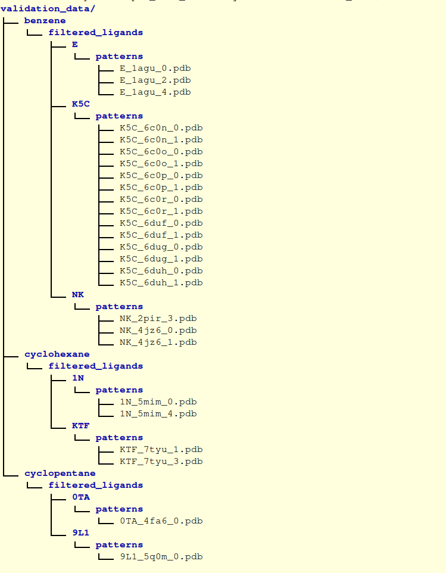

# ConfAnalyser

Import ConfAnalyser and run from another python script:
```python
from ConfAnalyser import ConfAnalyser

result = ConfAnalyser(paths_file=paths_to_pdbs_path, names_file=atom_names_path,
             molecule_type=ConfAnalyser.MoleculeType.Cyclohexane).result()
```

Run as a command-line application:
`python3 ConfAnalyser.py -l paths_to_pdbs -n atom_names --(cyclohexane|cyclopentane|benzene)`

# Electron density coverage analysis scripts

## Installation

Copy the content of `electron_density_coverage_analysis` folder from the repository into the folder with same name (`electron_density_coverage_analysis`).


## Setting up the environment

Create conda environment from `environment.yaml`, e.g.:

You can use [Conda](https://conda.io/projects/conda/en/latest/user-guide/install/index.html)

```
conda env create -f environment.yaml
```

Or [Mamba](https://mamba.readthedocs.io/en/latest/installation.html)

```
mamba env create -f environment.yaml
```

## Running analysis for a single structure
Use `electron_density_coverage_analysis.py`, which is a program that determines electron density coverage of a cycle. By default, uses trilinear interpolation to infer the electron density value, and considers an atom to be covered by the electron density when the corresponding intensity is MORE than the threshold for the isosurface (1.5 sigma).

### Arguments description

#### Positional arguments
  - `input_cycle_pdb`      Input PDB file with coordinates of a cycle, produced by `PatternQuery`
  - `input_density_ccp4`   Input electron density file for the corresponding protein structure from the PDB in CCP4 format      

#### Optional arguments
  - `-s`                   Simple mode - output is two numbers: first is the number of covered atoms, the second is the total number of atoms in a cycle
  - `-d`                   Detailed mode - output a sequence of paried values, where the first member of each pair is a serial atom number, and the second member is "y" - if atom is covered, and "n" - if it is not.      
  - `-m`, `--more_or_equal`  Atom is considered to be covered by the electron density when the corresponding intensity is MORE OR EQUAL to the threshold for the isosurface       
  - `-c`, `--closest_voxel`  Instead of trilinear interpolation, the intensity of the closest voxel is used


### Example of running analysis for a single structure

Activate created conda environment, e.g.

```
conda activate ed-coverage-analysis
```

From `electron_density_coverage_analysis` directory run the script in e.g. `simple` mode with e.g. `--more_or_equal` setup:
```
python electron_density_coverage_analysis.py -sm tests/example_input/single_structure/3biu_0.pdb tests/example_input/single_structure/3biu.ccp4
```


## Running analysis for multiple structures
It is possible to run the analysis for multiple structures using `main.py` script.

Input should follow a specific format:
<!-- TODO: put image to repo -->
 

The names of directories should be always as on the picture (`validation_data` as a main folder, then folders for three cycle types, folder `filtered_ligands` in each one, then folders for each ligand, then `patterns` folder in each of them), which contains `.pdb` files of cycles produced by `Pattern Query`. Filename format should always be as in the example: `{ligandID}_{pdbID}_{i}`, ligandID is ligand ID can be up to 3 characters long.

### Arguments description

#### Positional arguments
  - `rootdir`      Root directory (e.g. "validation_data") with files containing coordinates of cycles, produced by `PatternQuery`. Directory hierarchy should follow a specific format (see above)

#### Optional arguments
  - `-s`                   Simple mode - output is two numbers: first is the number of covered atoms, the second is the total number of atoms in a cycle  
  - `-m`, `--more_or_equal`  Atom is considered to be covered by the electron density when the corresponding intensity is MORE OR EQUAL to the threshold for the isosurface       
  - `-c`, `--closest_voxel`  Instead of trilinear interpolation, the intensity of the closest voxel is used


### Example of running analysis for a multiple structures

Activate created conda environment, e.g.

```
conda activate ed-coverage-analysis
```

From `electron_density_coverage_analysis` directory run e.g.:

```
python main.py tests/example_input/validation_data -sm
```

During the analysis procedure, `./ccp4` folder will be created inside `electron_density_coverage_analysis`, in which `.ccp4` files for structures corresponding to ligands, will be downloaded

Output of the script will be collected in `./output` folder including:
 - Three `.csv` files for each ligand type, e.g. `cyclopentane_params-sm_analysis_output.csv`, in names of which parameters (`sm`) for analysis are specified.
 Each `.csv` file follow a specific format, e.g.:

  06L_8gxp_0,06L,2;5\
  0GV_3v8d_1,0GV,5;5\
  0GV_8gdi_0,0GV,5;5\
  0GV_3v8d_0,0GV,5;5

  where first column specifies ligand PDB file name without extension, second column specifies ligand, third column specifies coverage - first number is a number of covered atoms, then semicolon, then the total number of atoms in a cycle

 - `no_ccp4_pdb_ids.txt` file with PDB IDs for which `.ccp4` files were not found at PDBe (`https://www.ebi.ac.uk/pdbe/coordinates/files/`)


